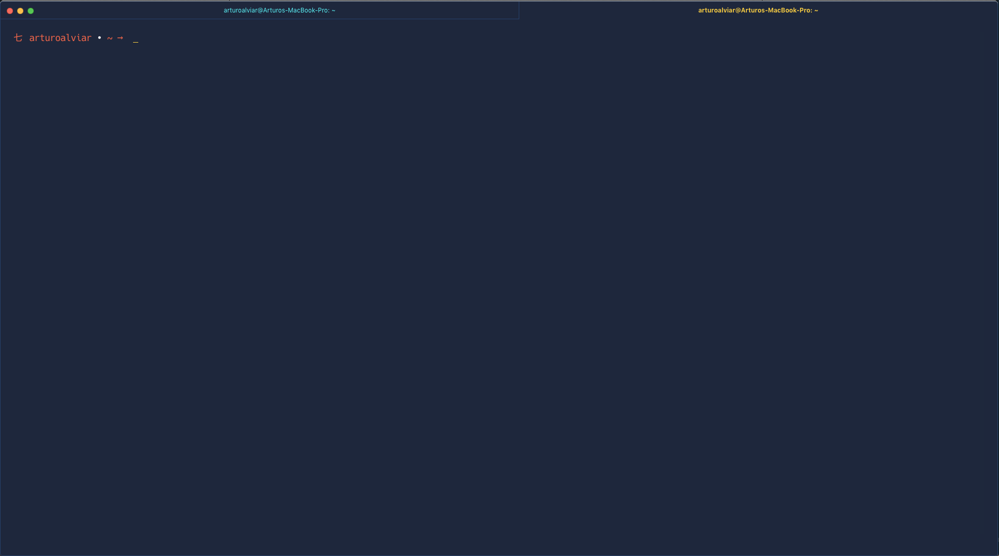

# Shichi ZSH theme
Shichi is a simple theme with the first character being 七(shichi/nana), the number 7. The primary color is red with a yellow accent.

---

## Screenshot

---

## Installation
Copy the shichi.zsh-theme file into your local oh-my-zsh/themes folder (usually found in your home directory ~/.oh-my-zsh/). Then set you ZSH_THEME to the name of the desired theme in the shichi.zshrc file.

---

## License
The MIT License.
